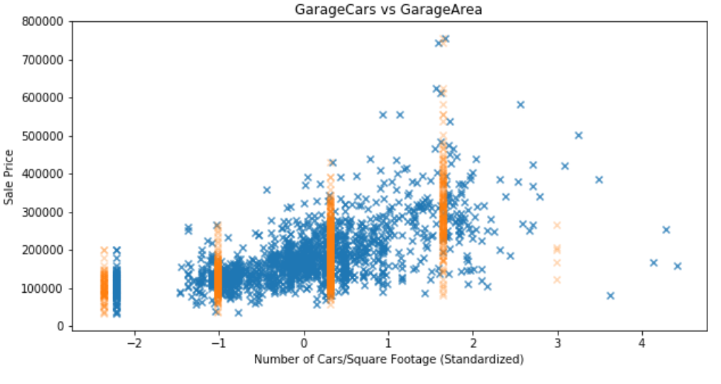

# House Prices: Advanced Regression Techniques (Top 8%)

## Removing Outliers

There are significant outliers in this data set. Identifying and removing such data points can have a great impact on the residual error your model.

## Feature Selection: Multicollinearity

Variance Inflation Factor can detect Multicollinearity.

where  is the from a regression of an input vector  from all of the other features. If  is close to 1, then collinearity is present, and so the VIF will be large.

Preforming this calculation found significant collinearity with 1StFlrSF all other features with a $VIF > 30$. This is consistent with the intuition that the first floor is going to be equal in size the the square footage of the basement and second floor.

Also GarageAre proved to had

Removing these features showed a significant increase in score.
